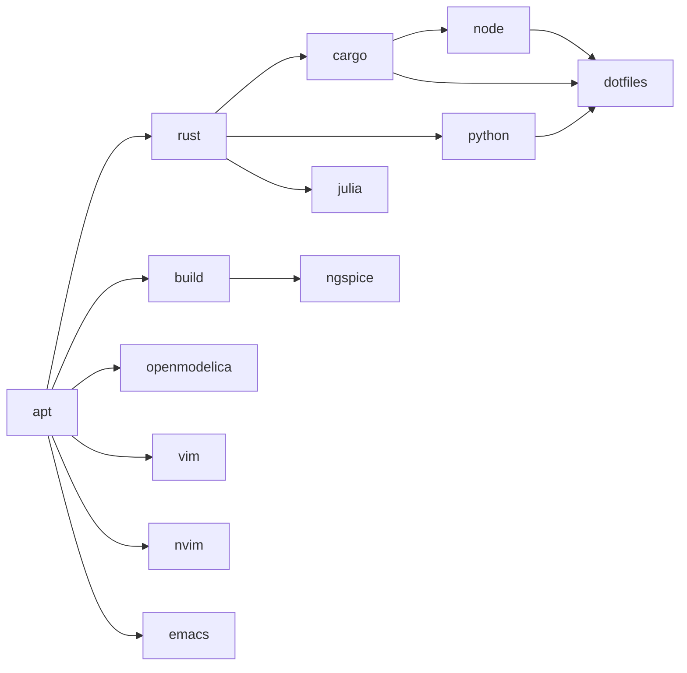

# Runtime architecture

This describes the existing bootstrap and focused optional-completion layer.
Desired state lives in
[config/bootstrap.toml](../config/bootstrap.toml); installation inventories and
operator recovery live in [USAGE.md](USAGE.md). Review dated qualification in
[VALIDATION.md](VALIDATION.md) before treating a supported mapping as tested
on a real machine.

## Entry and profile resolution

[bootstrap](../bootstrap) is a small POSIX Stage-0 launcher. It rejects root,
checks Ubuntu 26.04/resolute and x86_64/aarch64, obtains missing system
`/usr/bin/python3` using scoped sudo/APT, then hands control to
[cli.py](../bootstrap_lib/cli.py) with `-B`. Help has an early path that does not
install Python. `--plan` reaches Stage-0 before the Python CLI: if system Python
is missing, even a plan invocation can run APT to install it. Once in the CLI,
planning prints resolved profiles, architecture, dotfiles policy and update
selection without constructing a Context or running profile handlers.

[platform.py](../bootstrap_lib/platform.py) independently verifies the release,
architecture and original normal user. HOME must agree with that user's passwd
home and belong to the user. Incompatible custom Cargo, Rustup and uv Python
layout variables are refused. This keeps the managers compatible with the
selected shared dotfiles.

[config.py](../bootstrap_lib/config.py) validates immutable inputs, dotfiles and
completion definitions, then resolves dependencies in order with duplicates
removed. Unknown profiles and cycles fail. Defaults are `apt`, `rust`, `cargo`,
`python`, `node` and `dotfiles`; optional flags add profiles to that selection.
`--yes` omits the optional menu and accepts default shell consent unless an
explicit shell flag overrides it. Non-interactive installation requires an
explicit shell choice and available `sudo -n`.

The manifest's dependency edges are:

`node` depends on the Cargo profile because that profile owns fnm. `ngspice`
requires the generic build profile and adds its own libraries. OpenModelica
depends only on APT: the signed resolute/stable `omc` package may itself declare
compiler dependencies, but bootstrap does not select `build` for it. Cargo's
binary-first fallback separately obtains `build-essential`, `pkg-config` and
`libssl-dev`; this does not select the generic build profile either.

ARM64 decisions for selected profiles are made before resolving their
prerequisites again. Unqualified profiles default to decline unless explicitly
accepted; Cargo tools also have individual ARM64 decisions. A decline is a
reported skip. Supported metadata and opt-in logic do not imply ARM64
installation qualification.

## Context and execution

[runtime.Context](../bootstrap_lib/runtime.py) carries the manifest, arguments,
original passwd entry, HOME, architecture, controlled tool PATH, receipts and
status results. It creates user-owned data, cache and state directories under
the corresponding XDG roots, defaulting to `~/.local/share`, `~/.cache` and
`~/.local/state`, each with an `ubuntu-bootstrap` subdirectory. Managed directory
paths cannot traverse symlinks or belong to another user.

Each missing path component is created explicitly from the nearest existing
ancestor toward the requested leaf, requesting 0755 permissions. Restrictive
caller masks still apply, so 0077 produces 0700 directories. Existing ancestry
is checked before creating descendants; pre-existing unsafe paths are preserved
and refused, never chmodded. Every new directory and its naming parent are
fsynced before creating the next component.

Installation uses the caller's umask OR 0022, before Context construction and
through child installers. A caller mask of 0002 therefore becomes 0022 during
installation, while 0077 remains 0077. The original mask is restored on success
or failure and before entering a final interactive login shell. Help and planning
do not change it. Publication continues to reject symlinked/non-directory
ancestry and non-sticky parents writable by group/others.

The CLI takes a nonblocking exclusive `flock` on the state directory's `lock`
before installation; a second bootstrap using that state directory is refused.
The plan path precedes this lock. Commands and their output append to
`bootstrap.log`; receipts and `last-run.json` are published by replacing a
temporary state file after file fsync, followed by parent-directory fsync.
Receipt loading, transaction recovery and inline-inventory normalization occur
under the exclusive lock before ownership decisions. Symlinked lock, receipt, log and diagnostic destinations
are refused. These files provide diagnostics and ownership observations;
they are not the configuration authority.

| Handler/module | Responsibility |
| --- | --- |
| [apt.py](../bootstrap_lib/apt.py) | Missing or selected update packages, cached index refresh until sources change, no recommendations |
| [rust.py](../bootstrap_lib/rust.py) | Stable/minimal rustup, verified cargo-binstall release and explicit manifest crates; locked source fallback when necessary |
| [python.py](../bootstrap_lib/python.py) | User-owned uv/uvx and managed stable CPython with user-local default launchers |
| [node.py](../bootstrap_lib/node.py) | Managed fnm default Node LTS, version and architecture checks |
| [julia.py](../bootstrap_lib/julia.py) | Juliaup release channel without scheduled/startup self-updates |
| [editors.py](../bootstrap_lib/editors.py) | APT Vim/terminal Emacs and verified official stable Neovim archives |
| [ngspice.py](../bootstrap_lib/ngspice.py) | Checksummed release source, normal-user build/DESTDIR staging, verified system publication |
| [openmodelica.py](../bootstrap_lib/openmodelica.py) | Reviewed key fingerprints, signed Release metadata, managed resolute/stable source and CLI-only `omc` |
| [dotfiles.py](../bootstrap_lib/dotfiles.py) | Pinned checkout, upstream plugins/selective restore and selected-config validation |
| [completions.py](../bootstrap_lib/completions.py) | Post-handler application-provided Zsh completion integration |
| [optional_completions.py](../bootstrap_lib/optional_completions.py) | Conditional package-provider registration, unavailable reporting and official Juliaup native integration |
| [shell.py](../bootstrap_lib/shell.py) | Consent, original-user shell change, verification and interactive entry eligibility |

## Ownership and updates

An existing executable found on PATH is insufficient evidence of ownership.
`Context.owned` checks managed paths against receipt hashes, file types and
user ownership where applicable. Missing components can be installed; unmanaged
or externally changed components are preserved and refused until explicitly
reviewed and adopted with a supported `--adopt COMPONENT`. Adoption still
requires valid types/owners and component-specific manager checks. Partial
unmanaged installations are refused. Completion artifacts have their own
strict receipt checks. Base `.zfunc` artifacts have no adoption flag; a reviewed
native Juliaup integration can be reconciled only with explicit `--adopt julia`.

Ordinary reruns validate and preserve working owned tools. `--update` acts on
the selected manifest-managed channels and APT package lists; optional profiles
must still be selected. Cargo updates pass one manifest crate at a time to
cargo-binstall, never an all-installed switch. Installed `cargo-update` is a
user utility, not bootstrap's bulk update engine. Manager metadata and executable
versions must agree. Receipts cannot introduce unrelated tools into this loop.
The selected stable crates.io version is resolved once per application operation,
before either installer, and verified against the resulting Cargo registration.
[cargo_binary.py](../bootstrap_lib/cargo_binary.py) supervises cargo-binstall's
structured diagnostics to reject announced long GitHub retry delays before
publication. It leaves discovery, archive verification and installation upstream;
it is not a second installer. Automatic credential discovery is disabled. Known
transport/unavailable-binary failures retain the locked source fallback; malformed
metadata/archive, signature and publication failures stop. Cancellation verifies
unchanged executable/registration evidence before allowing fallback. Unproven
leftover Cargo staging paths are preserved and reported, never broadly removed.
See [the exact policy and qualification evidence](CARGO_RETRY_2026-10-03.md).
Dotfiles remain at their full pinned SHA and ngspice remains at its source
release/checksum/configuration; updating channels does not loosen these pins.

Downloads require HTTPS. Pinned sources and official release assets are checked
against SHA-256; archive extraction refuses links, special files and traversal.
[system_assets.py](../bootstrap_lib/system_assets.py) copies verified normal-user
staging into a sibling system tree with scoped sudo, moves the prior working
tree aside and publishes the replacement. A failed final rename restores the
predecessor where possible. Working predecessors remain for recovery;
interrupted publication or unrelated command links require inspection rather
than deletion of existing trees.

## Dotfiles and completions

The dotfiles checkout must have the exact expected origin, clean working tree
(including ignored files), full pinned HEAD
`b0fecc41f00fa2423aaf22478f2cec98cdf15229` and no index flags hiding changes
before upstream scripts execute. Bootstrap calls upstream dependency reporting,
pinned plugin installation, then selective restore preview and apply using
repeated `--file` arguments for `.zshrc`, `.zshenv`, `.gitconfig`, `.tmux.conf`
and `.config/starship.toml`. It does not substitute the upstream three-file
`--profile shell` preset or implement a second restore.

Upstream restore protections and backups govern replacement. A rerun may back
up and replace local edits to these selected shared files; unchanged files do
not create backups. Bootstrap verifies selected contents, Zsh syntax/startup,
Starship TOML/prompt, Git pager, an isolated tmux server and pinned plugin
checkouts. Optional dependency findings in a successful upstream report do not
add excluded configs or make missing Zellij/Mermaid prerequisites fatal. Git
identity in `~/.gitconfig.local` and account authentication remain user actions.

The current pinned `.zshenv` normalizes Zsh's base PATH with Cargo ahead of
inherited Linux/Windows entries, then optional `~/bin` and `~/.local/bin`.
Interactive `.zshrc` adds the optional Neovim preference and current fnm
multishell. Neither sources `~/.local/bin/env` nor injects `~/.juliaup/bin`;
native Julia completions remain under `~/.julia/juliaup/`. Bootstrap's controlled
subprocess PATH likewise omits the exact legacy Julia directory. No substring
or prefix filtering is applied to paths. Bash/login configuration is not restored.

After each successful application handler, the completion hook reads only that
profile's manifest definitions. It uses secure, discoverable system completions
under `/usr` first; Ubuntu's `_gh` remains system-owned. Otherwise the original
normal user executes the owned application's generator and stages output in
`~/.zfunc`. The first line must declare the command with `#compdef`, the file
must contain autoload code and `zsh -n` must pass before atomic publication.
New directories request 0755, with restrictive masks retained, and generated files
are 0644; existing insecure,
symlinked, unmanaged or externally edited artifacts are preserved and refused.

Receipts observe generator executable hash, arguments and reported version;
unchanged valid output is reused, and changed sources trigger regeneration.
Cargo additionally observes the active Cargo version because its rustup-generated
loader can stay unchanged across toolchain updates. Failed/empty/invalid
generation preserves a prior working file and its receipt. Restored dotfiles
expose `.zfunc` through Zsh's `fpath`/`compinit`. Existing shell initialization
retains its own integration; tools without a suitable declared runtime generator
receive no invented completion files. See
[upstream interfaces](UPSTREAM.md#zsh-completion-interfaces).

`optional_zsh_completions` separately declares every optional profile, including
system and explicitly unavailable providers. After the selected application's
handler succeeds, package/artifact contents and actual restored Zsh registration
are inspected. Shared functions such as `_vim` and `_gcc` are mapped explicitly;
system candidates must be package-owned, root-owned, secure through all parents,
and first in the effective `fpath`. Personal shadows are preserved and reported
as conflicts. No system provider is copied to `.zfunc`. Unavailable providers
produce a nonfatal status/receipt; generic file completion is not mislabeled as
an application provider. A later qualified system provider can be recognized.

The probe observes the restored shell's existing `_comps`; it does not run a
second `compinit` that could repair missing startup registration during testing.
The loading probe must use the same command/function/path selection whose
package ownership was verified, and checks the actual function source. Base
and optional command names share one duplicate-protection boundary.

Package/artifact inventories are canonicalized and SHA-256 addressed once in
`receipts.json` under `_completion_inventories` (`schema = 1`, `snapshots`). Each
command observation uses `inventory_ref`. Identical inventories share an identity;
changed contents create a new identity. Inline legacy observations normalize
automatically without altering ownership hashes; bad digests/references fail
closed. Unreferenced snapshots are removed on receipt publication. Inventories
remain diagnostic evidence, and the manifest remains desired-state authority.

For selected Julia, the owned `juliaup completions zsh` generator publishes the
official sourced script at `~/.julia/juliaup/completions/zsh.zsh`, the exact
location read by the pinned dotfiles. Native validation separately checks syntax,
`juliaup` registration and the real `julia +channel` handler/candidates. The
strict generic autoload validator is unchanged. The native script is generated
as the user and staged beside its destination; failed generation preserves the
old script, and failed final restored-shell validation rolls back publication
while retaining its previous timestamp and receipts. Both native command observations are published together through a persistent
artifact/state transaction. Generated base completions and transitions to system
providers reuse that publication primitive. Before COMMITTED, startup recovery
restores the previous artifact and receipts; after COMMITTED it keeps the new
matching pair. Recovery runs before handlers under the state lock, validates
paths/types/owners/hashes, retains recovery copies until a terminal state is
durable, and cleans only transaction-owned staging. Failed recovery stops the
run and reports retained material. See [maintenance design](MAINTENANCE_2026-10-03.md).
Existing native files and parents must be user-owned and
not writable by group/others; only newly created directories get secure modes.
Unchanged observed sources
preserve valid files; changed generator versions/hashes/arguments refresh them.
An upstream refresh is accepted automatically only when it matches the installed
official generator exactly. Unmanaged or personal edits otherwise require review
and explicit Julia adoption. No duplicate Julia `_tool` files or compatibility
links are created. Incompatible custom Juliaup depots are refused.

Build coverage includes compiler aliases, Make, pkg-config, CMake/CTest/CPack,
Ninja, traditional Binutils commands and primary Debian package-build commands.
Internal dpkg-dev plumbing, architecture-prefixed aliases and unrelated
transitive utilities are outside this completion inventory. Bison/Flex providers
are checked for selected ngspice. Selection, not incidental presence of compiler
packages from a Cargo fallback, controls this work. Unselected profiles do no
preparation; later selected profiles and updates run the same ownership checks.

## Privilege, failures and final shell

The whole bootstrap never runs as root. APT, system publication and consented
`chsh` use explicit scoped sudo; user managers, source compilation, upstream
restore/plugins and completion generation run as the original user.
Shell selection validates Zsh against `/etc/shells`, targets the original
non-root passwd entry and verifies the result. Declining consent does not run
`chsh`. Root's login shell is never the target.

| Failure boundary | Result |
| --- | --- |
| Entry/platform/manifest/Context/lock failure | Stops before profile execution; returns nonzero with available diagnostics |
| Default profile handler failure | Marks that profile failed, stops subsequent handlers and skips shell choice |
| Optional handler failure | Marks the profile failed and continues independent profiles; unavailable dependencies are skipped and a requested dependent profile is marked failed |
| Completion integration failure | Records `<profile> completions` separately, keeps the installed application and continues dependent application handlers |
| Shell verification/change failure | Records `shell` failure; existing installation observations remain available |
| Deliberately declined ARM64 component | Records a skip; decline alone is not a failed installation |

If no default handler failed, shell consent can still be reached after an
optional or completion failure, and a consented login-shell change may occur.
The CLI then prints the status summary/log path and writes `last-run.json`.
Any recorded failure makes the overall run return 1 and prevents entering Zsh.
A successful run may exec a login Zsh only with an interactive terminal, outside
CI and non-interactive mode, after releasing the lock. Keyboard interruption
returns 130; an early exception can occur before final summary/state publication.

## Manager capability and Cargo migrations

Python and Julia depend on Rust, independently of the `cargo` CLI collection.
The common application installer lazily ensures cargo-binstall once per run.
Package specifications are read from the existing Cargo tool list or the owning
Python/Julia manifest section; there is one installer and one scoped update path.
Juliaup binary ownership uses `juliaup`; the `julia` receipt observes runtime/channel
state. Native completion generator ownership uses `juliaup`, while reviewed
`--adopt julia` consent still governs native completion reconciliation.

Legacy uv and Juliaup launcher migration requires the exact previous managers,
paths, hashes and supported types. Replacement Cargo registration and binaries
are validated before any old launcher is retired; a durable journal reconciles
interrupted retirement and final receipt publication. No environment, depot,
channel, directory or unrelated executable is removed.
