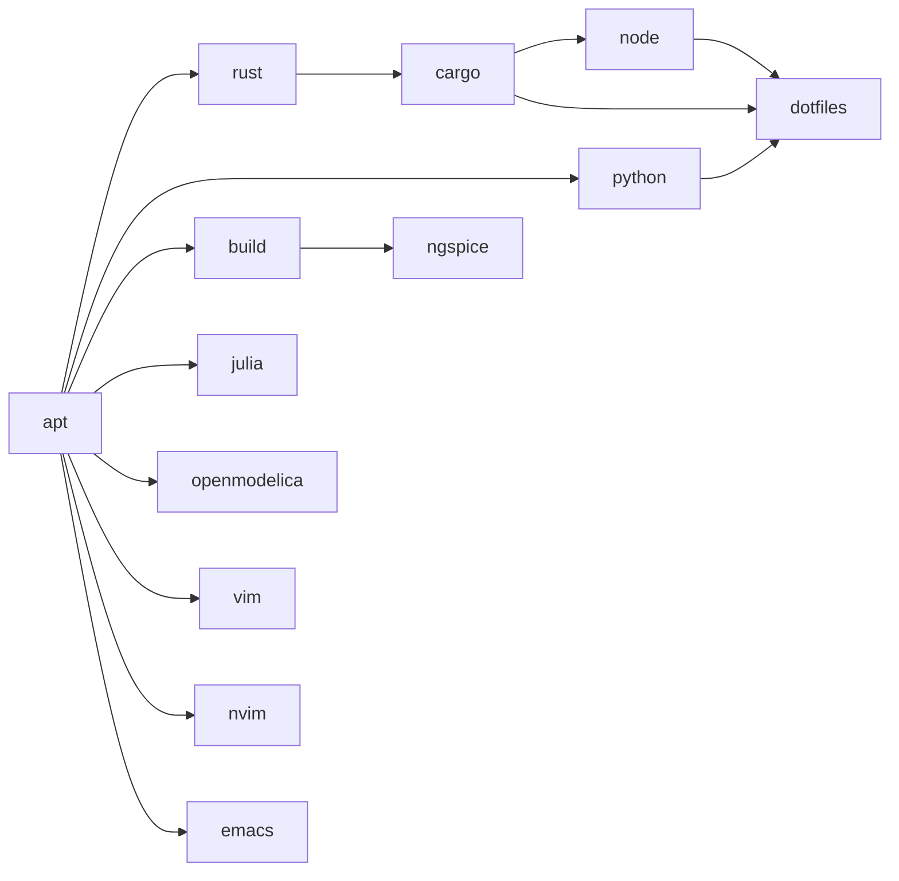

# Runtime architecture

This describes the existing implementation at `f5e841a`. Desired state lives in
[config/bootstrap.toml](../config/bootstrap.toml); installation inventories and
operator recovery live in [USAGE.md](USAGE.md). Review dated qualification in
[VALIDATION.md](VALIDATION.md) before treating a supported mapping as tested
on a real machine.

## Entry and profile resolution

[bootstrap](../bootstrap) is a small POSIX Stage-0 launcher. It rejects root,
checks Ubuntu 26.04/resolute and x86_64/aarch64, obtains missing system
`/usr/bin/python3` using scoped sudo/APT, then hands control to
[cli.py](../bootstrap_lib/cli.py) with `-B`. Help has an early path that does not
install Python. `--plan` reaches Stage-0 before the Python CLI: if system Python
is missing, even a plan invocation can run APT to install it. Once in the CLI,
planning prints resolved profiles, architecture, dotfiles policy and update
selection without constructing a Context or running profile handlers.

[platform.py](../bootstrap_lib/platform.py) independently verifies the release,
architecture and original normal user. HOME must agree with that user's passwd
home and belong to the user. Incompatible custom Cargo, Rustup and uv Python
layout variables are refused. This keeps the managers compatible with the
selected shared dotfiles.

[config.py](../bootstrap_lib/config.py) validates immutable inputs, dotfiles and
completion definitions, then resolves dependencies in order with duplicates
removed. Unknown profiles and cycles fail. Defaults are `apt`, `rust`, `cargo`,
`python`, `node` and `dotfiles`; optional flags add profiles to that selection.
`--yes` omits the optional menu and accepts default shell consent unless an
explicit shell flag overrides it. Non-interactive installation requires an
explicit shell choice and available `sudo -n`.

The manifest's dependency edges are:

`node` depends on the Cargo profile because that profile owns fnm. `ngspice`
requires the generic build profile and adds its own libraries. OpenModelica
depends only on APT: the signed resolute/stable `omc` package may itself declare
compiler dependencies, but bootstrap does not select `build` for it. Cargo's
binary-first fallback separately obtains `build-essential`, `pkg-config` and
`libssl-dev`; this does not select the generic build profile either.

ARM64 decisions for selected profiles are made before resolving their
prerequisites again. Unqualified profiles default to decline unless explicitly
accepted; Cargo tools also have individual ARM64 decisions. A decline is a
reported skip. Supported metadata and opt-in logic do not imply ARM64
installation qualification.

## Context and execution

[runtime.Context](../bootstrap_lib/runtime.py) carries the manifest, arguments,
original passwd entry, HOME, architecture, controlled tool PATH, receipts and
status results. It creates user-owned data, cache and state directories under
the corresponding XDG roots, defaulting to `~/.local/share`, `~/.cache` and
`~/.local/state`, each with an `ubuntu-bootstrap` subdirectory. Managed directory
paths cannot traverse symlinks or belong to another user.

The CLI takes a nonblocking exclusive `flock` on the state directory's `lock`
before installation; a second bootstrap using that state directory is refused.
The plan path precedes this lock. Commands and their output append to
`bootstrap.log`; receipts and `last-run.json` are published by replacing a
temporary state file. Symlinked lock, receipt, log and diagnostic destinations
are refused. These files provide diagnostics and ownership observations;
they are not the configuration authority.

| Handler/module | Responsibility |
| --- | --- |
| [apt.py](../bootstrap_lib/apt.py) | Missing or selected update packages, cached index refresh until sources change, no recommendations |
| [rust.py](../bootstrap_lib/rust.py) | Stable/minimal rustup, verified cargo-binstall release and explicit manifest crates; locked source fallback when necessary |
| [python.py](../bootstrap_lib/python.py) | User-owned uv/uvx and managed stable CPython with user-local default launchers |
| [node.py](../bootstrap_lib/node.py) | Managed fnm default Node LTS, version and architecture checks |
| [julia.py](../bootstrap_lib/julia.py) | Juliaup release channel without scheduled/startup self-updates |
| [editors.py](../bootstrap_lib/editors.py) | APT Vim/terminal Emacs and verified official stable Neovim archives |
| [ngspice.py](../bootstrap_lib/ngspice.py) | Checksummed release source, normal-user build/DESTDIR staging, verified system publication |
| [openmodelica.py](../bootstrap_lib/openmodelica.py) | Reviewed key fingerprints, signed Release metadata, managed resolute/stable source and CLI-only `omc` |
| [dotfiles.py](../bootstrap_lib/dotfiles.py) | Pinned checkout, upstream plugins/selective restore and selected-config validation |
| [completions.py](../bootstrap_lib/completions.py) | Post-handler application-provided Zsh completion integration |
| [shell.py](../bootstrap_lib/shell.py) | Consent, original-user shell change, verification and interactive entry eligibility |

## Ownership and updates

An existing executable found on PATH is insufficient evidence of ownership.
`Context.owned` checks managed paths against receipt hashes, file types and
user ownership where applicable. Missing components can be installed; unmanaged
or externally changed components are preserved and refused until explicitly
reviewed and adopted with a supported `--adopt COMPONENT`. Adoption still
requires valid types/owners and component-specific manager checks. Partial
unmanaged installations are refused. Completion artifacts have their own
strict receipt checks and no completion adoption flag.

Ordinary reruns validate and preserve working owned tools. `--update` acts on
the selected manifest-managed channels and APT package lists; optional profiles
must still be selected. Cargo updates pass one manifest crate at a time to
cargo-binstall, never an all-installed switch. Installed `cargo-update` is a
user utility, not bootstrap's bulk update engine. Manager metadata and executable
versions must agree. Receipts cannot introduce unrelated tools into this loop.
Dotfiles remain at their full pinned SHA and ngspice remains at its source
release/checksum/configuration; updating channels does not loosen these pins.

Downloads require HTTPS. Pinned sources and official release assets are checked
against SHA-256; archive extraction refuses links, special files and traversal.
[system_assets.py](../bootstrap_lib/system_assets.py) copies verified normal-user
staging into a sibling system tree with scoped sudo, moves the prior working
tree aside and publishes the replacement. A failed final rename restores the
predecessor where possible. Working predecessors remain for recovery;
interrupted publication or unrelated command links require inspection rather
than deletion of existing trees.

## Dotfiles and completions

The dotfiles checkout must have the exact expected origin, clean working tree
(including ignored files), full pinned HEAD
`f7c3eb9ce433a1a8e285afdcda06c1da56c018fd` and no index flags hiding changes
before upstream scripts execute. Bootstrap calls upstream dependency reporting,
pinned plugin installation, then selective restore preview and apply using
repeated `--file` arguments for `.zshrc`, `.zshenv`, `.gitconfig`, `.tmux.conf`
and `.config/starship.toml`. It does not substitute the upstream three-file
`--profile shell` preset or implement a second restore.

Upstream restore protections and backups govern replacement. A rerun may back
up and replace local edits to these selected shared files; unchanged files do
not create backups. Bootstrap verifies selected contents, Zsh syntax/startup,
Starship TOML/prompt, Git pager, an isolated tmux server and pinned plugin
checkouts. Optional dependency findings in a successful upstream report do not
add excluded configs or make missing Zellij/Mermaid prerequisites fatal. Git
identity in `~/.gitconfig.local` and account authentication remain user actions.

After each successful application handler, the completion hook reads only that
profile's manifest definitions. It uses secure, discoverable system completions
under `/usr` first; Ubuntu's `_gh` remains system-owned. Otherwise the original
normal user executes the owned application's generator and stages output in
`~/.zfunc`. The first line must declare the command with `#compdef`, the file
must contain autoload code and `zsh -n` must pass before atomic publication.
New directories are 0755 and generated files 0644; existing insecure,
symlinked, unmanaged or externally edited artifacts are preserved and refused.

Receipts observe generator executable hash, arguments and reported version;
unchanged valid output is reused, and changed sources trigger regeneration.
Cargo additionally observes the active Cargo version because its rustup-generated
loader can stay unchanged across toolchain updates. Failed/empty/invalid
generation preserves a prior working file and its receipt. Restored dotfiles
expose `.zfunc` through Zsh's `fpath`/`compinit`. Juliaup and existing shell
initialization retain their own integrations; tools without a suitable declared
runtime generator receive no invented completion files. See
[upstream interfaces](UPSTREAM.md#zsh-completion-interfaces).

## Privilege, failures and final shell

The whole bootstrap never runs as root. APT, system publication and consented
`chsh` use explicit scoped sudo; user managers, source compilation, upstream
restore/plugins and completion generation run as the original user.
Shell selection validates Zsh against `/etc/shells`, targets the original
non-root passwd entry and verifies the result. Declining consent does not run
`chsh`. Root's login shell is never the target.

| Failure boundary | Result |
| --- | --- |
| Entry/platform/manifest/Context/lock failure | Stops before profile execution; returns nonzero with available diagnostics |
| Default profile handler failure | Marks that profile failed, stops subsequent handlers and skips shell choice |
| Optional handler failure | Marks the profile failed and continues independent profiles; unavailable dependencies are skipped and a requested dependent profile is marked failed |
| Completion integration failure | Records `<profile> completions` separately, keeps the installed application and continues dependent application handlers |
| Shell verification/change failure | Records `shell` failure; existing installation observations remain available |
| Deliberately declined ARM64 component | Records a skip; decline alone is not a failed installation |

If no default handler failed, shell consent can still be reached after an
optional or completion failure, and a consented login-shell change may occur.
The CLI then prints the status summary/log path and writes `last-run.json`.
Any recorded failure makes the overall run return 1 and prevents entering Zsh.
A successful run may exec a login Zsh only with an interactive terminal, outside
CI and non-interactive mode, after releasing the lock. Keyboard interruption
returns 130; an early exception can occur before final summary/state publication.
